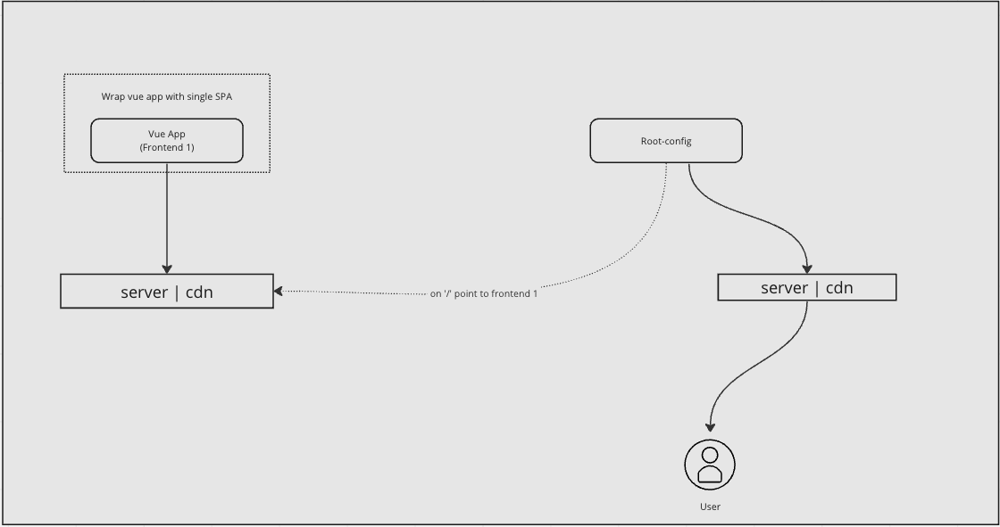

# Single SPA + Vite
[Link](https://github.com/isaurssaurav/single-spa-ssr) to SSR example.



As of now setup is little messy(TODO).
## Project Setup

```sh
npm install
npm run build
```

## Serve the Vue project

```sh

cd vue-app 

npx http-server ./vue-app/dist --cors
```

Copy and paste the served url of vue app in root-config and vue-app .env and run serve again

## TODO
- Better way to start the project